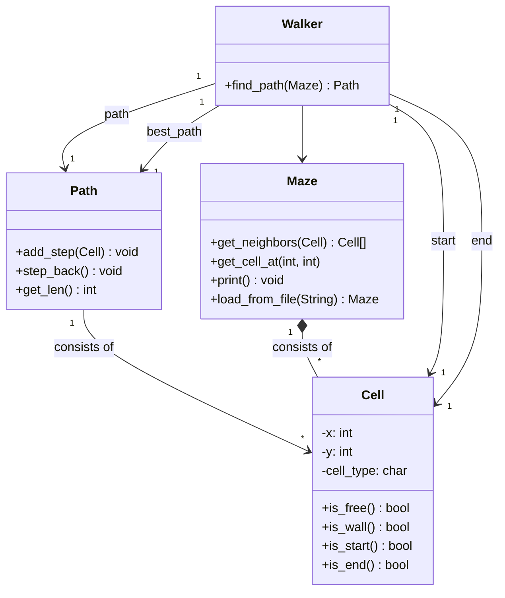

# dynamic_programming_pathfinding
simple example to apply top-down dynamic programming

## Problem Description: 2D Maze Pathfinding
You are given a 2D grid representing a maze. Each cell in the grid can either be:
- Free (denoted by ' ')
- Wall (denoted by #)
- the Start cell (denoted by S)
- the End cell (denoted by E)
You can walk on a free-cell, you cannot walk on a wall-cell. The maze will be surrounded by walls.

The maze has a starting point S and an ending point E. Your task is to write a program that calculates the shortest path from S to E. The path can only move up, down, left, or right, and cannot pass through blocked cells (walls).


## Example Maze:

```
######################
#                    #
#          S         #
#     ###########    #
#      #        #    #
#      #        #    #
########    #   #    #
#      ##   #        #
#      #    #        #
#           ##########
#                  E #
######################
```

## Class Diagram
